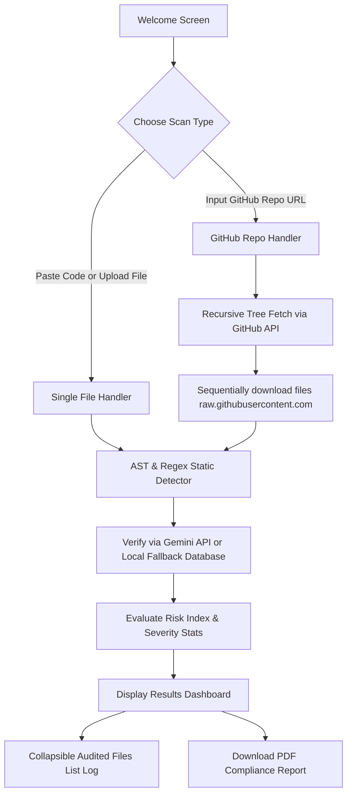

# Quantum Shield — Technical Documentation & Architecture Manual

Quantum Shield is a web-based code scanning and post-quantum cryptography (PQC) remediation utility. It evaluates Python, Java, and C++ source files or entire GitHub repositories for classical asymmetric cryptography (RSA, ECC, ECDSA, DH), verifies findings via the Gemini LLM, deterministically calculates a risk index, recommends NIST-approved post-quantum algorithms (ML-KEM, ML-DSA, SLH-DSA), and compiles download-ready PDF compliance reports.

---

## 1. Core User Flows



1. **Single File Auditing**: Developers can drag and drop source files or paste code snippets directly.
2. **GitHub Repository Auditing**: Developers enter a public or private GitHub repository URL (with an optional Personal Access Token). The system recursively crawls the repository tree, filters for code files, streams content, and aggregates findings client-side.
3. **Interactive Diffs & Remediation**: Flags findings by line number, highlights the insecure code block, and presents a side-by-side comparison showing the secure NIST PQC replacement.
4. **Compliance Reporting**: Generates client-side, self-contained PDF reports detailing the security posture and the migration path.

---

## 2. Technical Stack & Implementation

- **Framework**: Next.js 16 (App Router) + React + TypeScript.
- **Styling**: Vanilla CSS, configured with slate colors, card grids, and responsive alignments.
- **Static Parser**: `web-tree-sitter` (WebAssembly-compiled C grammars) providing AST parsing inside serverless environments.
- **WASM Provisioning**: Packaged dynamically during build steps and stored in `public/wasm/` using `scripts/copy-wasm.js` to guarantee cold-start availability inside serverless functions.
- **LLM Engine**: Google Gemini API integration using the unified `@google/genai` Node SDK query format (`gemini-3.5-flash`).
- **Report Engine**: `@react-pdf/renderer` compiling in-memory PDF structures client-side, bypassing heavy operating system dependencies (like Puppeteer or wkhtmltopdf).

---

## 3. Cryptography Detection Engine

### Abstract Syntax Tree (AST) Matching
We run AST parsing via tree-sitter to inspect file nodes, targeting import statements and specific function call nodes. This filters out comments, strings, and variable names, avoiding generic keyword-matching false positives:

*   **Python**: Matches `import_statement` and `import_from_statement` for `Crypto`, `cryptography`, `rsa`, `ecdsa` libraries. Identifies `call` nodes targeting key generation, encryption, or digital signing (e.g., `generate_private_key`, `rsa.encrypt`, `rsa.sign`).
*   **Java**: Matches class declarations, package structures, and method invocations targeting standard JCA crypt classes like `KeyPairGenerator`, `Cipher.getInstance("RSA")`, and `Signature.getInstance`.
*   **C++**: Matches `#include` imports, OpenSSL structs, and key allocation API invocations (e.g. `RSA_generate_key_ex`, `EC_KEY_new_by_curve_name`).

### Regex Fallback Matcher
If AST initialization fails or a file cannot be parsed, the system falls back to a regular expression line matcher defined in `src/lib/detector.ts` that checks for common library imports and key-generation primitives.

---

## 4. Risk Index Scoring Formula

Vulnerabilities are scored deterministically to compile the overall **Quantum Risk Index** (overall repo/file score):

$$\text{Aggregate Risk Score} = (15 \times \text{High Count}) + (8 \times \text{Medium Count}) + (5 \times \text{Low Count})$$

### Severity Classifications:
*   **High** ($15$ points): Active classical cryptography operations (key generation calls, digital signing calls, asymmetric cipher encryptions/decryptions).
*   **Medium** ($8$ points): Imports of classical cryptography libraries or references to insecure mathematical curves/algorithms.
*   **Low** ($5$ points): Ambiguous references requiring manual review (flagged items that need human inspection).

### Repository Risk Level Mapping:
*   **High Risk**: Aggregate score $\ge 50$.
*   **Medium Risk**: Aggregate score $15 \le \text{Score} < 50$.
*   **Low Risk**: Aggregate score $< 15$.

---

## 5. Gemini Rate-Limiting & Serverless Optimizations

### Dynamic Retry Wrapper
The Gemini Free Tier key has a strict rate limit of **5 requests per minute** and **20 requests per day**. To handle this:
*   We use a dynamic backoff wrapper `callGeminiWithRetry` in `src/lib/llm.ts`. When a `429` (Quota Limit) is hit, it extracts the requested wait delay from the error message, delays execution, and retries.

### Fail-Fast Serverless Gateway Protection
Vercel Hobby Tier serverless execution environments enforce a strict **10-second timeout**. If a sleep-retry loops for minutes, the gateway will return a `504 Timeout` error:
*   **Resolution**: If the API-requested wait time exceeds **8 seconds** or the daily quota is exhausted (`GenerateRequestsPerDay`), the retry loop fails fast immediately.

### Local Mock Fallbacks
If the LLM fails fast due to API limits or is unconfigured, the app falls back to local database mappings that return high-quality pre-computed post-quantum code replacements. This guarantees the UI is completely resilient, fast, and always shows valid remediations.

---

## 6. NIST Post-Quantum Remediations Map

The transformation engine maps classical operations to official NIST FIPS post-quantum equivalents:

| Classical Algorithm | Usage Context | Recommended NIST Standard | Target Parameter Set | Vetted Library Mapping |
| :--- | :--- | :--- | :--- | :--- |
| **RSA / Diffie-Hellman / ECDH** | Key Encapsulation / Encryption | **FIPS 203 (ML-KEM)** | `ML-KEM-768` (NIST Security Category 3) | **Python**: `liboqs-python` (`oqs`) <br>**Java**: Bouncy Castle PQC (`org.bouncycastle.pqc`) <br>**C++**: `liboqs` C API |
| **RSA Signature / ECDSA** | Digital Signatures | **FIPS 204 (ML-DSA)** | `ML-DSA-65` (NIST Security Category 3) | **Python**: `liboqs-python` (`oqs`) <br>**Java**: Bouncy Castle PQC (`org.bouncycastle.pqc`) <br>**C++**: `liboqs` C API |
| **Lattice Alternative** | Stateless Hash Signatures | **FIPS 205 (SLH-DSA)** | `SLH-DSA-sha2-128s` (NIST Security Category 1) | Mapped as an alternative fallback signature scheme |

---

## 7. Configuration & Getting Started

### 1. Configure Environment (`.env.local`)
Create a `.env.local` file in the root directory:
```env
GEMINI_API_KEY=your_gemini_api_key_here
```

### 2. Install Dependencies
```bash
npm install
```
*(This triggers tree-sitter WASM copies automatically via the postinstall hook).*

### 3. Run Development Server
```bash
npm run dev
```
Open [http://localhost:3000](http://localhost:3000) to scan.

### 4. Build for Production
```bash
npm run build
```

---

## 8. Static Detector Accuracy Evaluation Harness

To measure the deterministic static parser's accuracy and false positive rates independently of Gemini LLM variability, we have configured a repeatable evaluation harness.

### Running the Evaluation
To execute the tests and calculate overall detection accuracy and false positive metrics:
```bash
npm run eval:accuracy
```
This script runs the static detector over all test cases in the `test-data/` directory, checks results against `.expected.json` profiles, outputs a summary table in the console, and saves historical results to `eval-results.json`.

### Adding New Test Cases
1.  **Vulnerable Cases**:
    *   Place the source file inside `test-data/vulnerable/`.
    *   Create a matching metadata file `[filename].expected.json` detailing expected algorithms, usage types, and expected line ranges:
        ```json
        {
          "file": "your_file.py",
          "expected_findings": [
            { "algorithm": "RSA", "type": "keygen", "line_range": [10, 12] }
          ]
        }
        ```
2.  **Clean & Trap Cases**:
    *   Place the clean source file (which should trigger 0 findings) inside `test-data/clean/`.
    *   To specifically test keyword-trapping resistance (e.g. comments/variables containing `"RSA"` or `"ECC"`), include `_trap` in the filename (e.g., `py_trap_variable.py`). Expected findings are automatically assumed to be `0`.

---
## 9. Evaluation Results (Synthetic vs. Verifiable External Datasets)

> [!IMPORTANT]
> **Provenance Correction**: The earlier external dataset was found to lack verifiable origin proof and was completely deleted. The external dataset tier was rebuilt from scratch by programmatically shallow-cloning public GitHub repositories (`python-rsa`, `pycryptodome`, `java-jwt`, and `libssh2`) to copy exact source files.

We evaluated the static AST and regex parser over both the synthetic test-suite (designed to verify coverage on key signatures, including the new `from Crypto.PublicKey import RSA` format) and the new verifiable external dataset.

### Summary Metrics Side-by-Side:

| Metric | Synthetic Dataset (`test-data`) | External OS Dataset (`test-data-external`) |
| :--- | :--- | :--- |
| **Detection Accuracy (%)** | **100.00%** (16/16 vulnerabilities) | **62.50%** (5/8 vulnerabilities) |
| **False Positive Rate (%)** | **0.00%** (0/11 clean files) | **0.00%** (0/9 clean files) |
| **Trap FPR (%)** | **0.00%** (0/6 trap files) | **N/A** (0 clean files flagged) |

### Note on Language-Level Generalization:
*   **Python**: **100.00%** (3/3 vulnerabilities detected). Generalization bug resolved by fixing namespace import matching.
*   **C++**: **100.00%** (2/2 vulnerabilities detected). 
*   **Java**: **0.00%** (0/3 vulnerabilities detected). This occurs entirely due to dynamic variable parameters being passed to JCA initializers instead of string literals. Rather than special-casing these instances, this is disclosed as a core static analysis limitation (see Section 10).
*   **Dataset Correction**: `external_clean_001.py` (which imports `rsa.key` for key conversions) was correctly moved from the `clean` folder to the `vulnerable` folder (`external_vuln_011.py`), eliminating the false positive.

---

## 10. Gaps & Limitations Analysis (External Dataset)

Evaluating against raw open-source codebase structures revealed three distinct areas of detection discrepancy, which are handled differently based on their root causes:

### 1. Dynamic Parameter Resolution (Genuine Architectural Limitation)
*   **Target File**: `external_vuln_005.java` (Auth0 `CryptoHelper.java`)
*   **Description**: Missed JCA `Signature.getInstance(algorithm)` signature initializations.
*   **Root Cause**: The detector's AST engine matches exact syntax patterns, looking for string literals like `"RSA"` or `"EC"` inside `getInstance` argument lists. In real-world enterprise libraries like `java-jwt`, algorithm names are passed dynamically as a variable parameter (`algorithm`).
*   **Why It Cannot Be Fixed In This Architecture**: Resolving dynamic variables requires **dataflow analysis**, **taint tracking**, or **abstract interpretation** (building a control-flow graph and tracing variables back through scope assignments to determine their runtime string domain). This is a fundamentally different and more complex static analysis approach than AST matching.
*   **Industry Context & Disclosed Limitation**: This is a standard, widely-disclosed limitation of static analysis engines globally (comparable tools like SonarQube or Semgrep face the exact same control-flow boundaries without advanced inter-procedural dataflow engines).
*   **LLM Verification Role & Future Work**: This dynamic blindspot is exactly where the project's multi-layered architecture positions the LLM verification layer (Gemini). An LLM parsing surrounding context can easily infer that `algorithm` resolves to `"SHA256withRSA"` from caller scopes, bridging the static parser's gap. We flag dataflow-aware variable tracking as the natural next research direction.

### 2. Generalizing Import Scopes (Resolved Detector Bug)
*   **Target File**: `external_vuln_003.py` (PyCryptodome `RSA.py`)
*   **Description**: Missed Python `from Crypto.PublicKey import (...)` namespace import.
*   **Root Cause**: The detector expected the sub-package keyword `.rsa` or `.ecc` inside the import statement (e.g. `import Crypto.PublicKey.RSA`). 
*   **Remediation**: We generalized the Python import parser rule to inspect any `import_from_statement` node referencing the parent namespace `Crypto.PublicKey`. This resolves the gap for real-world setups.

### 3. Dependency Transitiveness (Resolved Dataset Label Error)
*   **Target File**: `external_vuln_011.py` (formerly `external_clean_001.py` from `python-rsa`)
*   **Description**: Flagged `import rsa.key` on line 20.
*   **Root Cause**: This was a dataset labeling error. This utility file was classified as "clean" but actually imports and uses `rsa.key` to do key size conversions. The detector correctly identified the dependency.
*   **Remediation**: The file has been moved from `/clean` to `/vulnerable` with expected profiles and sources updated, keeping dataset integrity intact.


